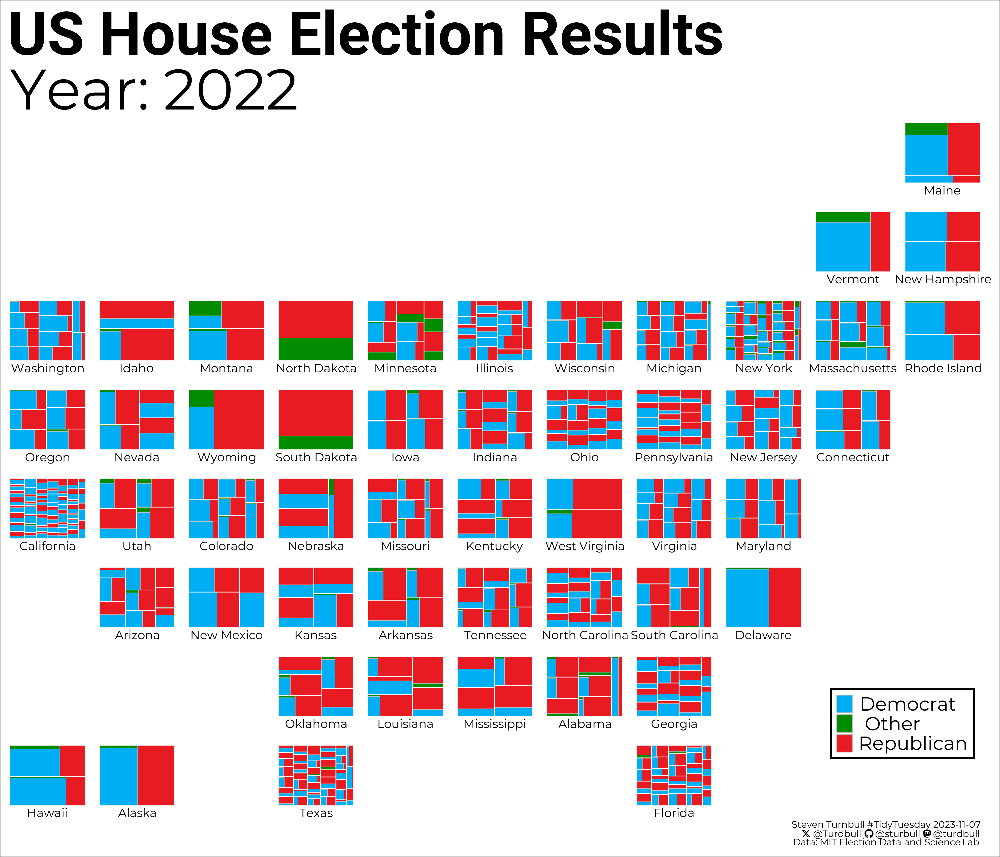
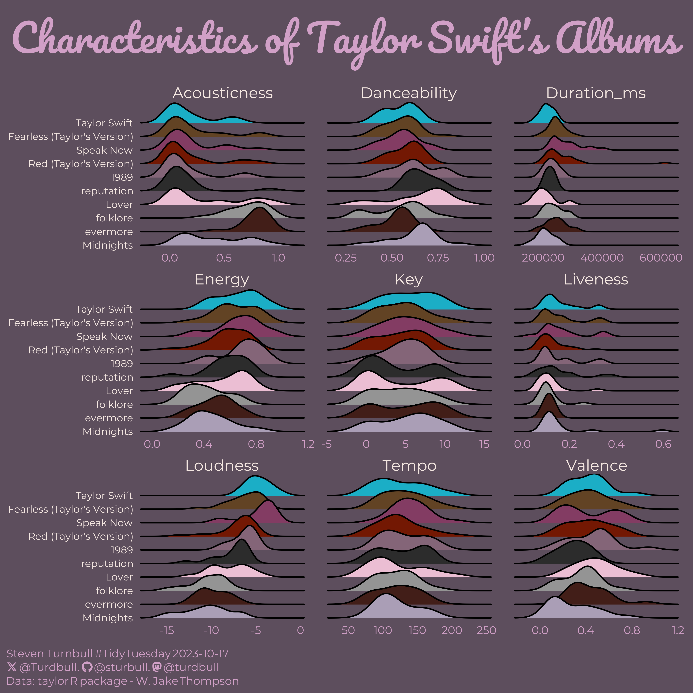

## About TidyTuesday

- `TidyTuesday` is a weekly social data project. All are welcome to participate! Please remember to share the code used to generate your results!
- `TidyTuesday` is organized by the R4DS Online Learning Community. [Join our Slack](https://r4ds.io/join) for free online help with R and other data-related topics, or to participate in a data-related book club!

***

Click on header or the chart for the code.

## [2023-11-21: R-Ladies](https://github.com/sturbull/tidytuesday/blob/master/code/2023_11_21_tidy_tuesday.Rmd)

## [2023-11-14: Diwali Sales](https://github.com/sturbull/tidytuesday/blob/master/code/2023_11_14_tidy_tuesday.Rmd)

## [2023-11-07: US House Election](https://github.com/sturbull/tidytuesday/blob/master/code/2023_11_07_tidy_tuesday.Rmd)

## [2023-10-31: Horror Legends](https://github.com/sturbull/tidytuesday/blob/master/code/2023_10_31_tidy_tuesday.Rmd)

## [2023-10-17: Taylor Swift Albums](https://github.com/sturbull/tidytuesday/blob/master/code/2023_10_17_tidy_tuesday.Rmd)

## [2023-10-10: Haunted Places in the US](https://github.com/sturbull/tidytuesday/blob/master/code/2023_10_10_tidy_tuesday.Rmd)

## [2023-10-03: US Grants](https://github.com/sturbull/tidytuesday/blob/master/code/2023_10_03_tidy_tuesday.Rmd)

## [2023-09-26: Richmond Way](https://github.com/sturbull/tidytuesday/blob/master/code/2023_09_26_tidy_tuesday.Rmd)

## [2023-09-19: CRAN Package Authors](https://github.com/sturbull/tidytuesday/blob/master/code/2023_09_19_tidy_tuesday.Rmd)

